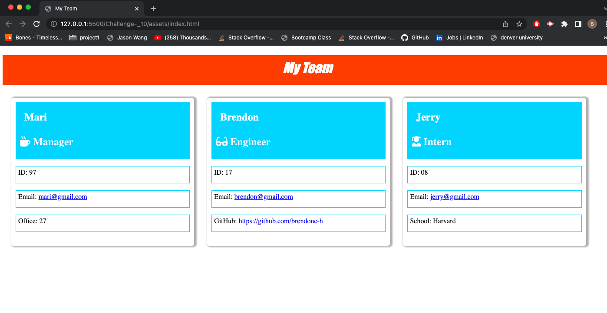

# Employee Team Builder App

### (Note: completed html file can be found in dist folder.)

## Introduction

For this assignment, I created an Employee team navigator using the command line with the npm inquirer package. Also, used npm package Jest for testing the constructor classes.

## Video

[Video Link](https://drive.google.com/file/d/1_eX28ufP1IMxzqR92c4YLy4PqzT-bwAU/view)

## Demo

After answering a series of questions in the command line, the data will be pushed to a pre-styled HTML page with boxes for different employee types: Manager, Engineer and Intern. You can multiple employees for each role.

Each role has different data inside of each cell. There is also icons to show what each role is.

The email links are live, so they open a modal for the user to compose an email directly.

For the "Engineer" employee, there is a live github link that goes directly to that employee's github profile which opens in a separate tab in the browser for convenience

## Challenges

Most of the code was simple to write. The challenges that I had was trying to get the html to link with the gerenateTeam.js. When writing the code many errors occured that I had to trouble shoot to fix.

## Future Development

This app doesnt seem to be applied to the real world as much as just practise on using the inquirer and jest pachages with node.